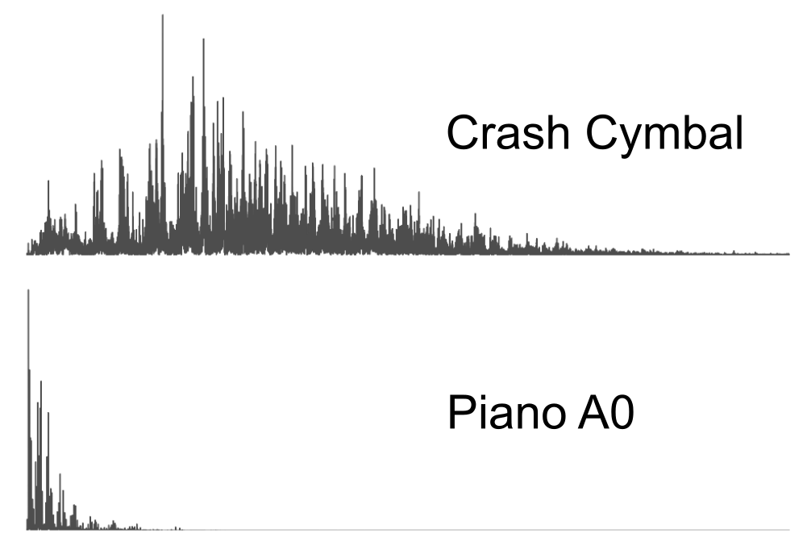
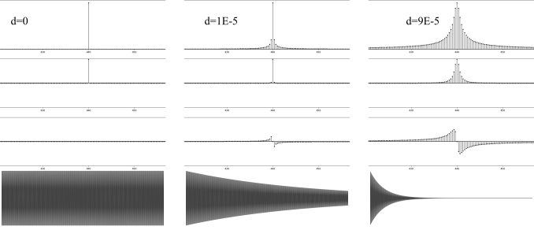
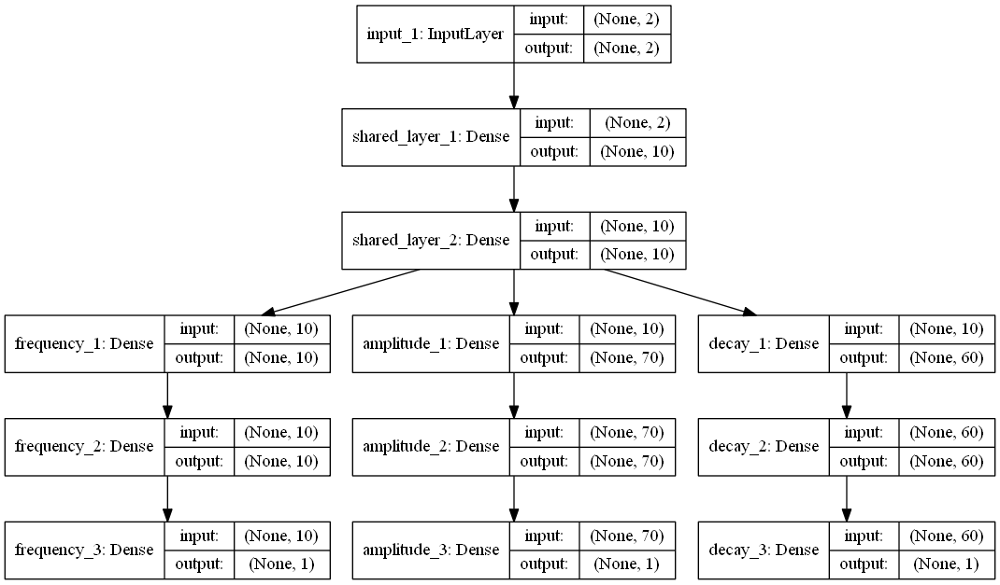
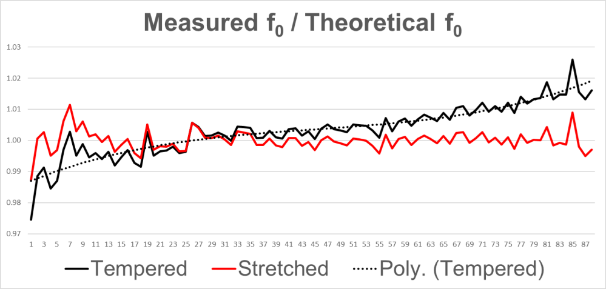
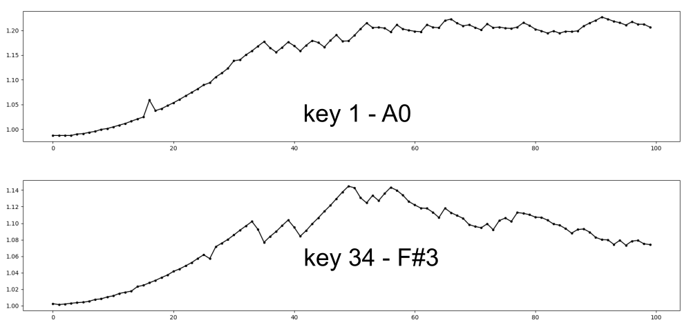
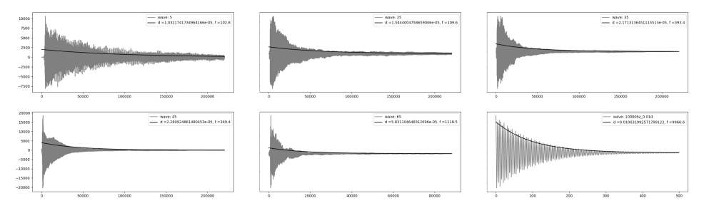
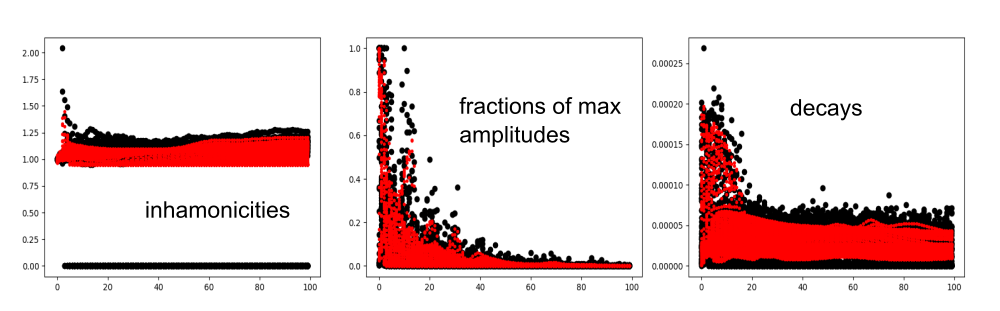
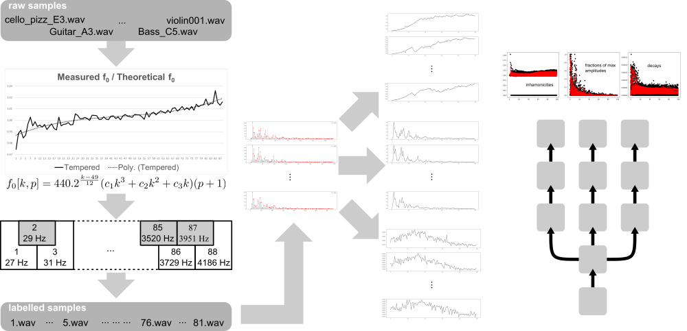

# Abstract
<!-- ~ 200 words -->

In order to exhibit a credible sound texture, digital musical instruments that possess real-world counterparts still rely heavily on the reproduction of manipulated pre-recorded samples. While the computing power of present-day computers enables their use in real-time, many restrictions arising from this sample-based design still persist; the huge on disk space requirements and the stiffness of articulations being the most prominent. While offering greater flexibility, pure synthesis approaches, in general based on physical properties of the instrument, fail to capture and reproduce certain nuances central to the verisimilitude of the emulation, offering a dry, synthetic output, at a high computational cost. We propose a method where ensembles of lightweight feed-forward neural networks working in parallel are learned, from crafted frequency-domain features of an instrument sound spectra, an arbitrary instrument's voice and articulations realistically and efficiently. We find that our method, while retaining perceptual sound quality on par with sampled approaches, exhibits 1/10 of latency times of industry standard real-time synthesis algorithms, and 1/100 of the disk space requirements of industry standard sample-based digital musical instruments. This method can, therefore, serve as a basis for more efficient implementations in dedicated platforms, such as keyboards and electronic drums and in general purpose platforms, like desktops and tablets or open-source hardware like Arduino and Raspberry Pi.

**Key-words:** neural networks, acoustic modeling, digital musical instruments, real-time audio synthesis

This research did not receive any specific grant from funding agencies in the public, commercial, or
not-for-profit sectors.

# Highlights

- Physically informed frequency-domain representations learned by neural networks can increase real-time synthesis efficiency.

- The model learns sound characteristics that are hard to model via conventional methods.

- Example based approaches allow a more intuitive model, with less adjustable parameters.

# Introduction
<!-- ~ 1000 to 2000 words -->

From industry's perspective, while the interest in digital musical instruments has grown significantly in the last decade [@staudt2016development], cutting-edge virtual instruments used in professional studios still rely primarily on collections of pre-recorded sound samples [@smith2008digital], demanding a high amount of disk space and reasonable processing power of the hardware (in general computers) in which they are implemented.

For platforms where processing power and storage are limited, such as digital keyboards and electronic drumkits, it is common the use of libraries of a smaller size and quality, to accommodate hardware restrictions, designed to enable the practice of the instrument; Production quality is achieved by connecting those devices to a computer and using them as controllers of a software implementation in order to access more elaborated libraries and algorithms. 

The recent developments in neural networks theory and applications suggest their potential to mitigate those limitations. In the field of computer vision, for instance, one can observe a plethora of developments that regularly expand the frontiers of the field.

Most of the work related to the application of neural networks in an audio context, however, approaches the task from a higher level of abstraction than the direct representation of sounds: Those are usually based in the manipulation of human-readable musical representations such as scores. The main reason for this is the high dimensionality of the data: in the case of CD quality audio, with a frame rate of 44100 samples per second, for example, the synthesis of a 10 seconds piece involves the creation of more than 4 million samples. 

The work developed by the teams behind Google Brain and DeepMind [@engel2017neural] is a notable exception: A neural architecture based on Wavenet [@van2016wavenet] is used to directly generate sound after training using audio samples from various musical instruments. The results show that a multi-layered convolutional architecture is able to learn time-domain representations for several instrument types. 

An experimental extension of this work, called Magenta [@magenta], further investigates latent representations for musical sequences in the time domain, from a probabilistic standpoint [@roberts2018learning; @roberts2018hierarchical]. 

We can take advantage of the periodic character of the samples and represent them, instead, in the frequency domain. The Fourier transform provides a perfect, reversible, representation of a wave in the frequency domain. Considering the fact that we are, in the present work, interested only in temporal representations in the real domain, the frequency-domain representations will consist of a vector of complex numbers, half the size of the original number of samples. 

At first, such a domain transformation would not introduce a more compact wave representation, from a storage point of view, since complex numbers are represented by pairs of real numbers in most programming languages. Considering, however, that the human ear is not able to perceive frequencies outside the 20 Hz to 20 kHz band, we have identified one of the advantages of working in the frequency domain: we can truncate the FFT result to this interval (taking care to translate it in terms of the local frequencies of the transform).

Another advantage comes in the form of its independence from the duration of the signal, which allows the use of a dense architecture in the prediction of arbitrary length waves. Further advantages of this approach will be illustrated in next sections, taking into account the physical characteristics of the instrument to be emulated and the properties of the transform, and will provide de theoretical basis to the method introduced here.

To the best of our knowledge, frequency-domain representations of sound, a popular technique in the digital signal processing field, were seldom used in the context of neural sound synthesis. (Albeit being common in neural-based sound classification tasks). This is unfortunate, as frequency-domain representations are far more well behaved than their time-domain counterparts when applied to harmonic sounds. Figure @fig:crashxpiano compares the two representations, in the case of harmonic and nonharmonic sounds.

{#fig:crashxpiano}

It's clear that the change of domain, via the efficient algorithm Fast Fourier Transform, greatly simplifies the representation of harmonic sounds. Insight from acoustic research can simplify those representations even further, alleviating the predictive burden of neural networks.

Considering the specific case of a standard grand piano, we can arrive at a basic model, to be extended later, that gives us a reasonable (albeit bland sounding) initial approximation. Observing that in equal-tempered instruments, as is the piano's case, the ratio of (theoretical) frequencies in adjacent notes is fixed at $2^{1/12}$, we can arrive at a formula of the form $f_0[k] = 440 ~ 2^\frac{k-49}{12}$ relating the 88 piano keys to their fundamental frequencies, where $k$ stands for the piano key number, from 1 to 88, and 440 Hz is the standard frequency for key 49, with pitch A4, also known as concert pitch.

In practice, however, the fundamental frequencies deviate some cents from their theoretical value, due to a tuning technique named octave stretching that flattens the lowest octaves and sharpens the highest ones, with respect to their theoretical fundamental frequencies, in an attempt to attenuate the clash between partials from different keys [@koenig2014spectral]. This consistent behavior, arising from aural tuning techniques, was first exposed by Railsback in a 1938 paper published in The Journal of the Acoustical Society of America where the tuning of various pianos was compared. The data can be seen in the figure @fig:railsback, with the smooth green line representing the average of deviations for various pianos.

![Railsback curve [@tung_2006]](images/railsback.png){#fig:railsback}

This can be cheaply incorporated into the model before the neural network's treatment. To account for the partials, one simple strategy consists in assuming the ideal string case, where partials are integer multiples of the key's fundamental frequency; we can thus write $f[p, k] = 440 . 2^\frac{k-49}{12} ~ (p+1)$
to denote the frequency of the pth partial of the kth key. 

While @fletcher1964normal, for example, proposes an equation that relates the fundamental frequency of a piano note with its pth partial, incorporating the inharmonicity present in piano strings, we can see from [@koenig2014spectral] that the inharmonicity coefficients per key aren't, in general, well behaved.
That's also the case of partials' amplitudes; neural networks are, thus, in a better position to extract hidden features and learn the underlying associations needed to reproduce and generalize those quantities.

It is important to note that the base of peaks in the frequency domain is proportional to the decay of the corresponding frequency in the time domain: The extreme case of a perfectly periodic sinusoid, with zero decay, has a frequency spectrum of zero at all but one frequency. The figure @fig:fourierDecay illustrates this relationship.

{#fig:fourierDecay}

One can observe that the decay introduces new frequencies around the nominal frequency, in addition to phase changes in the frequency-domain representation; it is empirically observed that the primordial effect of those frequencies and phases is to reproduce the decay (or, more broadly, envelope) of the wave.

From this observation, two important intuitions can be drawn: The first is that, with a reasonable degree of approximation, we can describe a harmonic sound generated by an impulsive excitation as a function of the location of some of its frequencies (partials), their respective intensities, and their decays.

As partials envelopes are to be directly accounted for, original phase information can be discarded without significant perceptual effects, as is suggested empirically from the reconstruction of waves with their original phases zeroed or randomized.

In the Github repository dedicated to this work [@tesserato_2018], on the path "resources/05 Final Model/03_waves_from_01_info/piano/" reconstructed waves can be found, where phase information was randomized for the 100 partial frequencies. They are reconstructions of the samples used to train the network, available at resources/05 Final Model/00_samples/piano/. 

Comparing the samples, one can see that the reproduction is quite plausible. Most of the perceptual difference between them originates in the number of partials considered, which does not include all the frequencies present in the transient phase of the wave in the lowest keys.

Noting, as we have, that harmonic instruments have a well-behaved frequency distribution, consisting basically of some peaks in their frequency domain representation, and assuming exponential decays of the form $e^{-dt}$, with one value of $d$ per partial and per key, one can elegantly account for the envelope of each one of the partials with knowledge of that partial's amplitude $a$ and decay rate $d$.

# Methods
<!-- ~ 1500 to 2000 words -->

based on the discussion presented in the introduction, a neural network was created, using the Keras library on top of the Tensorflow backend. The architecture can be seen in figure @fig:architecture. Receiving as inputs a array of the form $[k,p]$ where $k$ is the normalized piano key, in the range of 1 to 88, and $p$ is the normalized partial frequency of interest, from 1 to 100, the network was trained to output, in parallel, the residual inharmonicity, the decay and the amplitude of each key-partial pair.

{#fig:architecture}

The sound samples used to train the model are available at the website of the University of Iowa Electronic Music Studios [@iowa]. The library consists of a total of 260 samples recorded from a Steinway & Sons model B Grand Piano with a Neumann KM 84 microphone, and are encoded in stereo .aiff files, 16-bit, 44.1 kHz.

From this sample library, we made use of the 88 fortissimo articulations. Those were converted to mono .wav files with the same bitrate and framerate as the original .aiff format. Silences at the beginning of the files were removed and the audio intensity normalized.

Bearing in mind that the partial frequencies are approximately integer multiples of each key fundamental frequency one can search for the maximums in the frequency domain considering the appropriate intervals. Figure @fig:peaks compares this algorithm with the simple enumeration of the highest values of intensity, for a wave corresponds to the sound emitted by the key 35 of a piano, from which the first 30 partial frequencies are investigated.

{#fig:peaks}

Figure @fig:stretch, offers insight into the original tuning of the piano from which the samples were recorded from; a polynomial of rank 3 offers a good compromise between simplicity and accuracy in the approximation of the stretched tuning.

We can improve the theoretical fundamental frequencies $f_0(k) = 440 . 2^\frac{k-49}{12}$ with a term accounting for the octave stretching; As it was seen, this original equation disregards the inharmonicities present in the instruments, responsible for important characteristics of their timbres.

Nevertheless, it presents a very reasonable initial approximation that serves both to reinforce the basic harmonic characteristics in the final model and to alleviate the prediction effort of the network, insofar as we can add an inharmonicity term in the above equation to be learned by the network.

We can then write $f_0[k]$ as $440 . 2^\frac{k-49}{12} (c_1 k^3 + c_2 k^2 + c_3 k)$. The effort is justified by the fact that improvements in $f_0$ are carried to all the theoretical partial frequencies, as they are multiples of $f_0$, greatly simplifying the neural architecture needed in the model.

{#fig:stretch}

Thus, an arbitrary theoretical frequency, as a function of the piano key and the partial considered, can be expressed as as follows: $f_0[k, p] = 440 . 2^\frac{k-49}{12} (c_1 k^3 + c_2 k^2 + c_3 k) (p + 1) i[k, p], k \in {1, 2, ..., 88}, p \in \{0,1,2, ...\}$, where $i[k, p]$ is the inharmonicity as given by the network.

Despite being formulated and used in this work to learn a grand piano, this framework is convenient for a wide range of instruments, since these 88 keys range from A0 to C8, covering the frequency spectrum of most instruments of interest; To train the network from any instrument, one has simply to label the samples of the relevant sounds with the equivalent key number of a piano.

Considering both fundamental and partial frequencies in the audible spectrum, the model would have to learn a range of frequencies from 27 Hz, the fundamental frequency of A0, to a little more than 20 kHz, corresponding, for example, to the fifth partial of C8, if it was to estimate directly the partial frequencies of a piano.

Working with inharmonicities, on the other hand, reduced the interval to the limit between 0.98 and 1.02. In addition, the behavior of inharmonicities is reasonably predictable, with a slightly exponential character, as illustrated in @fig:inharmonicities.

{#fig:inharmonicities}

This same rationale is applied to the amplitudes, being predicted as a fraction of the maximum values ​​found in each of the keys (or notes, more generally, in the case of an arbitrary instrument being trained), and residing in the closed interval between 0 and 1.

The decay curve can be estimated considering the difference in intensity of an arbitrary frequency in the first and second halves of the wave, using the formula $d = 2 \ln(a_1 / a_2) / l$. Figure @fig:frequencydecay illustrates the application of this procedure to some samples. Note that only in the last case, the wave being a pure sinusoid, the extracted decay corresponds to the sample envelope.

{#fig:frequencydecay}

As it was observed, with an estimate of the partial frequency decay, the phase information has negligible impact on the sound of the reconstructed wave; we chose to randomize the phases: This approach has the advantage of imparting a more organic and varied character to the synthesized output of the final model, as no wave generated will be exactly the same as any other wave. Another option, less rich from the perceptual point of view, would be to give the phases an arbitrary value (such as zero, for example).

We chose to use, as activation function in each of the network layers, a modified version of the hyperbolic tangent, in the form $a(x) = \tanh (6 * x - 3) / 2 + 1/2$, so as to best cover the interval $[0,1]$ in which the inputs and outputs reside. 

The neural network used in the model has a total of 10,563 trainable parameters, that represent a size in disc of approximately 200 KB. The two initial layers, with 10 neurons each, are common to all the 3 predicted outputs, and provide a shared initial representation, to be extended later by each of the branches responsible for individual quantities.

This approach provides for less redundancy in the model while allowing for the number of neurons in the independent layers to be customized to account for the needs of each of the outputs; It's worth noting that the frequency approximations made a priori allowed a small number of neurons in the branch responsible for the inharmonicities. Figure @fig:results compares the original targets and the behavior learned by the network.

{#fig:results}

Thus, we can define a new methodology for sound modeling of harmonic instruments, dubbed "Neuro-Spectral Synthesis", as summarized in figure @fig:neurospectral:.

{#fig:neurospectral}

# Results and Discussion
<!-- ~ 1000 to 2000 words -->

In order to assess the quality of the proposed model, we compare its results and behavior with implementations of the two most used approaches in sound synthesis, namely, digital waveguides[smith2006basic] and the finite differences method [bilbao2009numerical]. For an in comparison of those methods, the reader is referred to @karjalainen2004digital.

On behalf of consistency, implementations of the two methods were prepared, in the Python programming language, and are available in a Github repository [@tesserato_2018] at "tesserato.github.io/resources/".

The neural model presents more realistic results than the implementations based on either digital waveguides or finite difference methods, and is at least 10 times more efficient, in comparison with author's implementations.

For comparison, taking into account the generation of 5 1-second waves at 44,100 FPS, the proposed method was, on average, 17 times faster than the Digital Waveguides-based method and 26 times faster than the finite differences. Table @tbl:comparison summarizes the results.

|               | Finite Differences | Digital Waveguides | Neuro-Spectral Synthesis |
|---------------|:--------------------:|:--------------------:|:--------------------------:|
| 1             | 16.95213819        | 13.81114888        | 0.5896253586             |
| 2             | 19.62042928        | 13.02065825        | 0.8354649544             |
| 3             | 24.25646234        | 11.33273816        | 0.7555158138             |
| 4             | 17.89053726        | 12.3500874         | 0.7475204468             |
| 5             | 18.00246739        | 12.12223339        | 0.7735056877             |
| **Average**         | **19.34440689**        | **12.52737322**        | **0.7403264523**             |
| **Standard Deviation** | **2.908692366**        | **0.937300851**        | **0.09102950916**            |
:Comparison of the latency in seconds for the 3 implementations {#tbl:comparison}

Sounds generated by the proposed model can be heard in a musical context in the authors Soundcloud [soundcloud.com/carlos-tarjano/sets/spectral-neural-synthesis](https://soundcloud.com/carlos-tarjano/sets/spectral-neural-synthesis)

Some tracks make use of a Drumkit generated with a similar approach as the one presented in this work. Worth of note is a hybrid instrument used in other tracks like the interpretation of Duke Ellington's Caravan, an amalgam hallucinated by the network based on training using samples of an acoustic bass, for the lowest notes, a violoncello for the middle of the register, and a violin for the highest notes.

The main limitation of the proposed methodology is that all the parameters to be manipulated in the final model must first have been incorporated into the training process. The two physical modeling paradigms used for comparison, both the finite difference method and the digital waveguides, allow some real-time manipulation of their parameters afterwards: in the examples presented, the excitation point can be changed from wave to wave and at any time, the pickup point can be changed, even during the simulation, reflecting on the timbre of the sound generated.

In addition, these models lend themselves to the reasonably trivial incorporation of a source, continuous or periodic, of excitation, and can be used for the simulation of continuous-sounding instruments, like bow-driven violins (unlike the pizzicato * drive here and metals, for example; this is not the case of the model proposed here, and constitutes a possibility of interesting future development.

Another barrier is that the model learns sound characteristics from examples and does not lend itself in a practical way to direct sound exploration; this must be done from another tool, and then incorporated into the model, at the time of its training.

# Conclusion
<!-- ~ 600 words -->

The present work, introducing a new technique of instrument modeling, demonstrates the potential of the use of neural networks to audio synthesis, establishing the potential of real-time applications.
The model generates more credible results than the most used and efficient real-time acoustic modeling algorithm found in the literature, at a lower computational cost.

Another advantage over conventional models based on physical simulation is that it can learn important sound characteristics that originate from parts of the system difficult to physically model, such as the influence of resonators of complex geometry, for example.

The present work shows that dense architectures, given a suitable representation, are able to learn features that allow the reproduction and generalization of sound samples in a direct way; from the introduction of a compact, physically informed representation of harmonic sound waves, the work shows the synergetic potential between research developments on the acoustics of musical instruments and the use of neural networks to base models for the emulation of these instruments, or families of instruments.

Furthermore, through the use of specially designed activation functions to accommodate the pertinent representation parameters and appropriate initialization methods of weights and biases, these architectures can be simplified and the required number of trainable parameters appreciably decreased, making them more effective for real-time sound synthesis.

The possibilities for future developments in this area of ​​intersection between neural networks and acoustics are numerous, given the scarcity of similar investigations: It would be interesting, for example, to use the outputs of a model based on the finite difference method, which can be formulated so as to simulate more sophisticated features of an instrument such as string stiffness, resonance and various terms of loss of a given acoustic system, at the cost of a high demand of computational resources, to train a model based on digital waveguides with a neural network at the point where losses and other calculations are concatenated.

Due to the high degree of recursion of the digital waveguides algorithm, direct training based on the expected outputs of the model is quite complex to be implemented; the output vectors of a simulation based on finite differences, however, are fully compatible with this approach, and the insertion of a neural network could lead to a model that retains at least part of the accuracy of the simulation by the finite difference method, with computational efficiency close to or even higher than that presented by the digital waveguides algorithm. In [@gully2017articulatory], for example, we find an example of this work, which explores the use of neural networks for the identification of relevant parameters to a simulation by digital waveguides of the human vocal tract.

Relax the simplification adopted during the work in relation to exponential decays is another future development with interesting potential: for some categories of sound, the human voice, for example, the envelope of the wave presents greater impact than the frequencies in perceptual characteristics of the sound, such as intelligibility.

Estimate the envelopes with the technique presented here, considering a larger number of points and use a neural network to learn the characteristics of that envelope for a set of samples from an arbitrary instrument, or even the human voice, is another interesting direction to be investigated.

Another development would be to implement the method in a more efficient programming language, such as C or C++, with the addition of a visual interface and compatibility with MIDI controllers. Those modifications can base a commercially viable product line, to be marketed in standalone and or VST plugin format.

# References
<!-- ~ 20 -->

